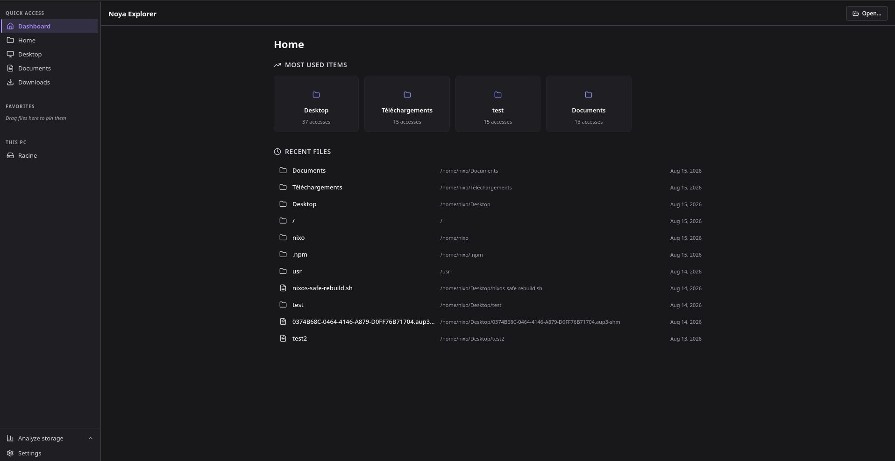
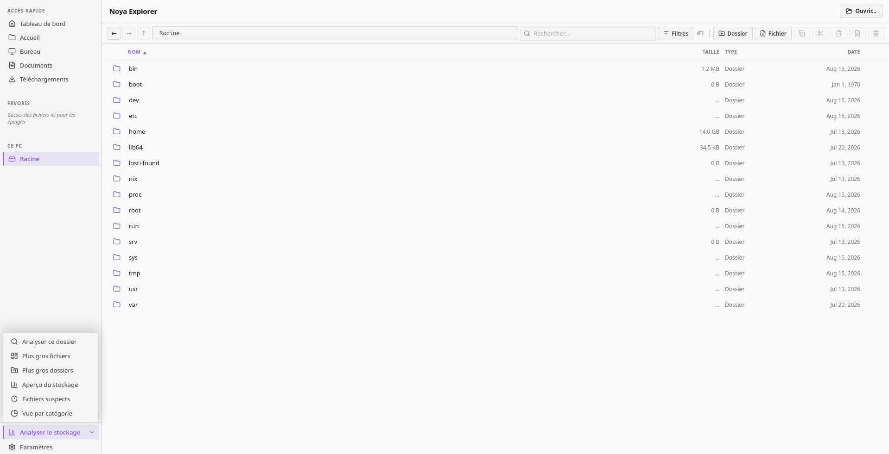

# Noya Explorer

A modern, lightweight and open-source file explorer for Windows, Linux and macOS.

Noya Explorer is built to make managing and understanding your files simpler. It combines a familiar file explorer with advanced search, storage analysis, cleanup suggestions and powerful drag & drop.

## 📸 Screenshots

## 🚀 Download

[Download Noya Explorer](../../releases/latest)

Pre-built releases are available for:

- Windows — ".exe"
- Linux — ".deb" / ".AppImage"
- macOS — ".dmg"

Just download the version for your operating system and run it. No development environment is required.

## ✨ What can Noya Explorer do?

### 📁 Explore your files

Browse your filesystem with a clean and modern interface.

You can navigate directories, manage files and folders, sort results, search for files and keep frequently used locations in your Favorites.

### 🔎 Find files faster

Noya Explorer provides advanced search filters for:

- Name
- Location
- Type
- Category
- Size
- Modification date
- Unused files

The location filter can search by filesystem path without being affected by letter case.

### 📊 Understand your storage

Instead of only showing files, Noya Explorer helps you understand how your storage is being used.

The analysis system provides:

- Global storage analysis
- Storage usage by category
- Percentage-based visualizations
- Clickable category filtering
- Unused file detection
- Suspicious file detection
- Cleanup suggestions

Analysis results are cached locally, so the different analysis views work from the same global scan.

### 🧹 Clean up your storage

Noya Explorer can suggest files that may no longer be useful.

You can select files, see how much space could be recovered and confirm the deletion before anything is removed.

### ⚠️ Spot suspicious files

Five lightweight heuristics are used to identify files that may deserve additional attention.

Flagged files are displayed in a dedicated view with badges explaining the detection.

> «This is not an antivirus. It is an additional tool for understanding your filesystem.»

### 🖱️ Drag & drop everywhere

Noya Explorer includes a complete custom drag & drop system.

You can:

- Move files and folders inside Noya Explorer
- Hold Ctrl to copy instead of moving
- Drop files onto Favorites
- Drag files from your operating system into Noya Explorer
- See a preview of the action before dropping

## ⚡ Lightweight and fast

Noya Explorer is built with Rust and Tauri 2, with a React and TypeScript interface.

The scanner was heavily optimized during development. One test went from approximately 260 seconds for 2 million files to around 5 seconds for 78,000 files after optimizing filesystem metadata operations.

Actual performance depends on the filesystem, storage device and number of files.

## 🌍 Cross-platform

Noya Explorer is designed to run on:

Windows · Linux · macOS

Platform-specific filesystem behavior is handled by the native Rust backend.

Release builds are automatically generated through GitHub Actions.

## 🛠️ Run from source

If you want to contribute to Noya Explorer or build it yourself:

### Requirements

- Node.js
- npm
- Rust
- Cargo
- Tauri dependencies for your operating system

### Clone

git clone https://github.com/Nixo0725/NoyaExplorer.git
cd NoyaExplorer

### Install

npm install

### Run

npm run tauri dev

### Build

npm run tauri build

For platform-specific Tauri requirements, see the [Tauri documentation](https://v2.tauri.app/start/prerequisites/).

## 🔒 Privacy

Noya Explorer is designed with a local-first approach.

Your files and filesystem information are analysed locally. Core functionality does not require uploading your files to a remote service.

Analysis data is cached locally on your computer.

## 🧰 Built with

- Rust
- Tauri 2
- React
- TypeScript
- Tailwind CSS

## 📖 Project

Noya Explorer is open source and developed publicly on GitHub.

Repository: [github.com/Nixo0725/NoyaExplorer](https://github.com/Nixo0725/NoyaExplorer)

Issues, suggestions and contributions are welcome.

## 🙌 Credits

Noya Explorer is built thanks to these open-source projects and resources:

**Icons**

- [lucide-react](https://lucide.dev) — all interface icons (settings, folders, file types, charts, …), from the [Lucide](https://github.com/lucide-icons/lucide) icon library
- [Tauri](https://tauri.app/start/icons/) — application icon set (see [`src-tauri/icons/`](src-tauri/icons/icon.png))

**Frontend**

- [React](https://react.dev) — UI library
- [Vite](https://vitejs.dev) — build tool
- [TypeScript](https://www.typescriptlang.org) — typed JavaScript
- [@tanstack/react-virtual](https://github.com/TanStack/virtual) — virtualized file lists
- [Inter](https://rsms.me/inter/) — interface font
- [JetBrains Mono](https://www.jetbrains.com/lp/mono/) — monospace font

**Backend (Rust)**

- [Tauri](https://tauri.app) — desktop framework ([plugin-opener](https://github.com/tauri-apps/plugins-workspace/tree/v2/plugins/opener), [plugin-dialog](https://github.com/tauri-apps/plugins-workspace/tree/v2/plugins/dialog))
- [Rayon](https://github.com/rayon-rs/rayon) — parallel filesystem scanning
- [Walkdir](https://github.com/BurntSushi/walkdir) — recursive directory traversal
- [tokio](https://tokio.rs) — async runtime
- [serde](https://serde.rs) — serialization
- [dirs](https://github.com/dirs-dev/dirs-rs) — OS directory paths
- [windows-sys](https://github.com/microsoft/windows-rs) — Windows API bindings

## 📜 License

Noya Explorer is released under the [PolyForm Noncommercial License 1.0.0](LICENSE). See the full license text for the terms.

---

Noya Explorer v1.0.0
